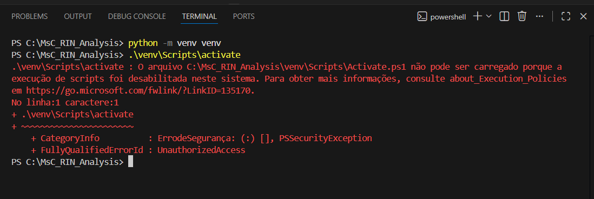

# Scripts Útilitários Gerais - Versão 0.1

## Manejo de Bibliotecas/Pacotes Python - Ambiente Python (venv) 

### Contexto e Objetivo
* **OBJETIVO:** Criar ambiente isolado específico Python para upload de pacotes e bibliotecas sem conflito com a máquina.
* **SITUAÇÃO:** Utilizado para upload de `requirements.txt` de ferramentas **Python**, permitindo o funcionamento de um software/ferramenta com todas as dependencias necessárias sem riscos de conflitos.
      * ***Exemplo:*** Executar uma webferramenta do `Streamlit` localmente.

### 1. Pré-Requisitos e Configuração Inicial
* Para que seja possível criar ambiente python, é necessário ter **`Python`**  instalado em versão igual o maior a 3.10.
     * Averiguando a existência de Python e versão:
          ```bash
                 # Em PowerShell/VSCode: (Funciona tanto em Windows quanto Linux)
                 python --version
                 # Outra alternativa:
                 python3 --version
          ```
### 2. Execução do Script
* **Ambiente python isolado:** A etapa é feita **dentro da pasta/diretório de interesse** *(ex: dentro do diretório de um repositório clonado)*. A localização onde o ambiente é criado delimita quais arquivos/pastas serão afetadas pelas alterações realizadas após setar o ambiente.
     * Definição de parâmetros *[Referência](https://docs.python.org/release/3.14.0/index.html)*:
          * `-m <module-name>`:  Busca sys.path pelo módulo previamente nomeado e executa seu processo no módulo principal. Permite utilizar comandos dentro do módulo `python` sem precisar "ativar" o módulo.
          * ` venv`: Criação de ambientes virtuais;
            ```bash
                 # Cria ambiente python (em Bash):
                 python -m venv venv

                 # Ativa o ambiente isolado (Windows)
                 .\venv\Scripts\activate
            
            ```
### 3. Troubleshooting: Permissão Windows para Ativação de ambiente
* Um problema bastante comum ao criar ambiente python venv em Windows são erros ao tentar executar a ativação do ambiente criado.
* **Erro:**
     
* **Solução:** Alteração das Políticas de Execução PowerShell do Sistema Operacional Windows [Referência](https://learn.microsoft.com/en-us/powershell/module/microsoft.powershell.security/set-executionpolicy?view=powershell-7.5).
     * Definição de Parâmetros:
          * `Set-ExecutionPolicy`: Modificação e setagem de execúção em PowerShell Windows.
          * `-Scope`: Parâmetro de especificação de valor *escopo* padrão.
          * `-Scope Process`: O escopo do processo afeta apenas a sessão atual do PowerShell. A política de execução é salva na variável de ambiente           `$Env:PSExecutionPolicyPreference` e é excluída quando a sessão é fechada.
          * `-ExecutionPolicy RemoteSigned`: O parâmetro `ExecutionPolicy especifica a política de execução. A política de execução `RemoteSigned` exige que todos os scripts e arquivos de configuração baixados da web sejam assinados por um editor confiável. É a política padrão para computadores com Windows Server.
          ```bash
               # Em caso do Erro acima ao tentar executar ativação do venv, utiliza-se o seguinte comando:
               Set-ExecutionPolicy -Scope Process -ExecutionPolicy RemoteSigned

               # Tente novamente a ativação do ambiente:
               .\venv\Scripts\activate
          ```           

  
